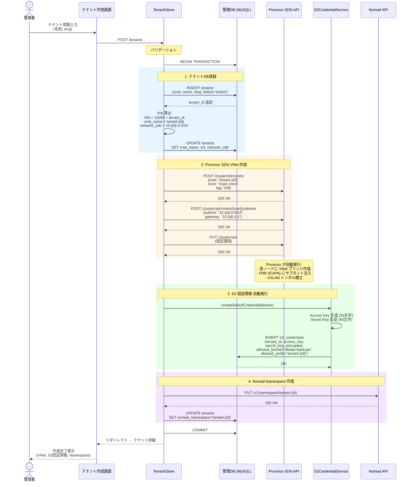
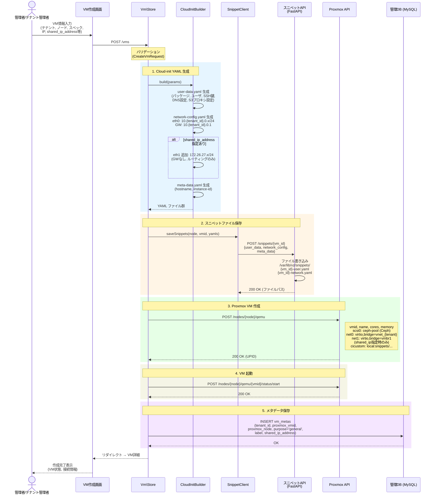
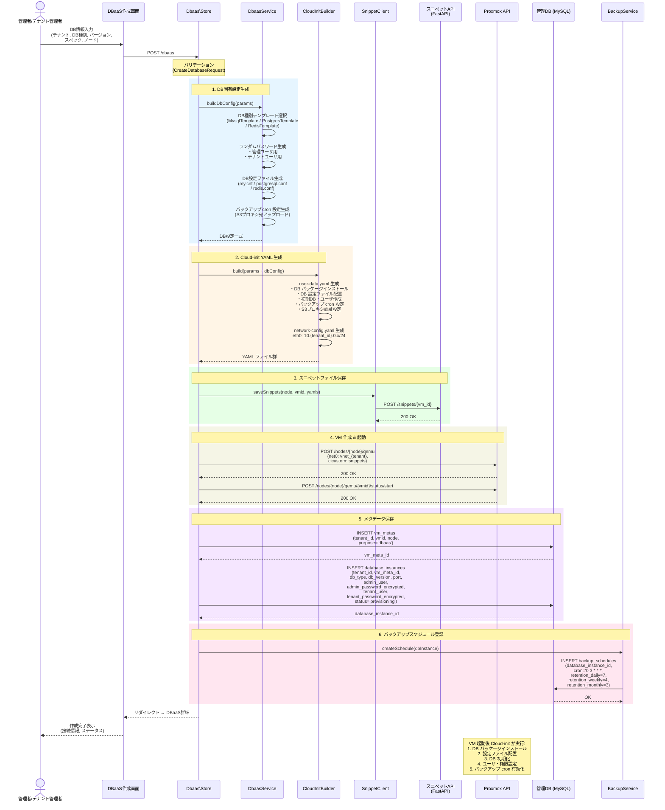

# 詳細設計書

## 1. システム全体アーキテクチャ

### 1.1 コンポーネント構成

```
┌─────────────────────────────────────────────────────────────────┐
│               mgmt-docker VM (Docker Compose)                    │
│                                                                  │
│  ┌─────────────────────────────────────────────────────────┐    │
│  │                 管理パネル (Laravel)                      │    │
│  │  ┌──────────┐ ┌──────────┐ ┌──────────┐ ┌────────┐    │    │
│  │  │ テナント  │ │ VM管理   │ │ DBaaS    │ │ CaaS   │    │    │
│  │  │ 管理     │ │          │ │ 管理     │ │ 管理   │    │    │
│  │  └────┬─────┘ └────┬─────┘ └────┬─────┘ └───┬────┘    │    │
│  │       │             │             │             │        │    │
│  │  ┌────┴─────────────┴─────────────┴─────────────┴────┐  │    │
│  │  │              Lib/Proxmox (自作ライブラリ)          │  │    │
│  │  │              Lib/Nomad (自作ライブラリ)            │  │    │
│  │  │              Lib/S3Proxy (認証情報管理)            │  │    │
│  │  └───────────────────┬───────────────────────────────┘  │    │
│  └──────────────────────┼──────────────────────────────────┘    │
│                          │                                       │
│  ┌──────────┐  ┌────────┼───┐  ┌──────────┐  ┌──────────┐     │
│  │ mgmt-db  │  │ s3-proxy   │  │   dns    │  │ registry │     │
│  │ (MySQL)  │  │   (Go)     │  │(CoreDNS) │  │ (Harbor) │     │
│  └──────────┘  └────────────┘  └──────────┘  └──────────┘     │
└──────────────────┼──────────────────────────────────────────────┘
                   │
         ┌─────────┼─────────────────┐
         │         │                 │
         ▼         ▼                 ▼
  [Proxmox API]  [Snippet API]    [Nomad API]
  (各ノード)     (各ノード/Docker)  (Nomad Server)
```

### 1.2 技術スタック

| レイヤー | 技術 | バージョン | 備考 |
|---------|------|----------|------|
| フロントエンド | Blade + TailwindCSS | TailwindCSS v4 | JS/TSフレームワーク不使用 |
| バックエンド | Laravel | 12.x | PHP 8.4+ |
| 管理DB | MySQL | 8.x | 最小限のメタデータのみ |
| スニペットAPI | Python + FastAPI | Python 3.12+ | 各Proxmoxノードに Docker コンテナで配置 |
| S3 プロキシ | Go (カスタム) | Go 1.22+ | S3互換、独自認証情報発行 |
| 内部 DNS | CoreDNS | 最新 | スプリットホライズン対応 |
| コンテナ基盤 | Nomad + Consul | Nomad 1.9+ | マルチテナント |
| レジストリ | Harbor | 2.x | 全テナント共有 |
| オブジェクトストレージ | 外部 S3 (AWS S3 / Wasabi) | - | S3プロキシ経由でアクセス |
| 監視 | OTel Collector + Grafana Cloud | - | メトリクス/ログ/トレース |
| コンテナ管理 | Docker Compose | v2 | インフラサービスのオーケストレーション |

---

## 2. 管理パネル (Laravel) 設計

### 2.1 ディレクトリ構成

```
app/
├── Http/
│   ├── Controllers/
│   │   ├── Auth/
│   │   │   ├── ShowLoginForm.php
│   │   │   ├── Login.php
│   │   │   ├── Logout.php
│   │   │   └── TwoFactor/          # 2FA (任意)
│   │   │       ├── Show.php
│   │   │       ├── Verify.php
│   │   │       ├── Setup.php
│   │   │       ├── Confirm.php
│   │   │       └── Disable.php
│   │   ├── Dashboard/
│   │   │   └── Index.php
│   │   ├── Tenant/
│   │   │   ├── Index.php
│   │   │   ├── Create.php
│   │   │   ├── Store.php
│   │   │   ├── Show.php
│   │   │   ├── Edit.php
│   │   │   ├── Update.php
│   │   │   └── Destroy.php
│   │   ├── Vm/
│   │   │   ├── Index.php
│   │   │   ├── Create.php
│   │   │   ├── Store.php
│   │   │   ├── Show.php
│   │   │   ├── Start.php
│   │   │   ├── Stop.php
│   │   │   ├── Reboot.php
│   │   │   ├── ForceStop.php
│   │   │   ├── Destroy.php
│   │   │   ├── Console.php
│   │   │   ├── Snapshot.php
│   │   │   └── Resize.php
│   │   ├── Dbaas/
│   │   │   ├── Index.php
│   │   │   ├── Create.php
│   │   │   ├── Store.php
│   │   │   ├── Show.php
│   │   │   ├── Start.php
│   │   │   ├── Stop.php
│   │   │   ├── Destroy.php
│   │   │   ├── Backup.php
│   │   │   ├── Backups.php
│   │   │   ├── Restore.php
│   │   │   ├── Upgrade.php
│   │   │   └── Credentials.php
│   │   ├── Container/
│   │   │   ├── Index.php
│   │   │   ├── Create.php
│   │   │   ├── Store.php
│   │   │   ├── Show.php
│   │   │   ├── Restart.php
│   │   │   ├── Scale.php
│   │   │   ├── Destroy.php
│   │   │   └── Logs.php
│   │   ├── Network/
│   │   │   ├── Index.php
│   │   │   ├── Create.php
│   │   │   ├── Store.php
│   │   │   ├── Show.php
│   │   │   └── Destroy.php
│   │   ├── Monitoring/
│   │   │   ├── Index.php
│   │   │   └── GrafanaUrl.php
│   │   ├── S3Credential/
│   │   │   ├── Index.php
│   │   │   ├── Store.php
│   │   │   ├── Show.php
│   │   │   ├── Destroy.php
│   │   │   └── Rotate.php
│   │   ├── Api/
│   │   │   ├── VmStatus.php
│   │   │   ├── NodeStatus.php
│   │   │   ├── DbaasStatus.php
│   │   │   └── ContainerStatus.php
│   │   └── Admin/
│   │       ├── Node/
│   │       │   ├── Index.php
│   │       │   ├── Store.php
│   │       │   └── Update.php
│   │       ├── User/
│   │       │   ├── Index.php
│   │       │   ├── Store.php
│   │       │   └── Update.php
│   │       ├── Dns/
│   │       │   ├── Index.php
│   │       │   ├── Store.php
│   │       │   ├── Update.php
│   │       │   ├── Destroy.php
│   │       │   └── Reload.php
│   │       └── Vps/
│   │           ├── Index.php
│   │           ├── Store.php
│   │           ├── Show.php
│   │           ├── Update.php
│   │           ├── Destroy.php
│   │           └── Sync.php
│   ├── Middleware/
│   │   ├── EnsureTenantAccess.php
│   │   └── EnsureAdminAccess.php
│   └── Requests/
│       ├── Vm/
│       │   ├── CreateVmRequest.php
│       │   └── UpdateVmRequest.php
│       ├── Dbaas/
│       │   ├── CreateDatabaseRequest.php
│       │   └── UpdateDatabaseRequest.php
│       └── Container/
│           └── DeployContainerRequest.php
├── Models/
│   ├── User.php
│   ├── Tenant.php
│   ├── VmMeta.php
│   ├── DatabaseInstance.php
│   ├── ContainerJob.php
│   ├── BackupSchedule.php
│   ├── S3Credential.php
│   ├── VpsGateway.php
├── Services/
│   ├── VmService.php
│   ├── DbaasService.php
│   ├── ContainerService.php
│   ├── BackupService.php
│   ├── S3CredentialService.php
│   ├── MonitoringService.php
│   ├── VpsGatewayService.php
│   └── CloudInit/
│       ├── CloudInitBuilder.php
│       └── Templates/
│           ├── BaseTemplate.php
│           ├── MysqlTemplate.php
│           ├── PostgresTemplate.php
│           └── RedisTemplate.php
├── Lib/
│   ├── Proxmox/
│   │   ├── Client.php          # HTTP クライアント基盤
│   │   ├── ProxmoxApi.php      # 統合エントリポイント
│   │   ├── Resources/
│   │   │   ├── Node.php        # ノード操作
│   │   │   ├── Vm.php          # VM (QEMU) 操作
│   │   │   ├── Storage.php     # ストレージ操作
│   │   │   ├── Network.php     # ネットワーク/SDN操作
│   │   │   └── Cluster.php     # クラスタ操作
│   │   ├── DataObjects/
│   │   │   ├── VmConfig.php
│   │   │   ├── VmStatus.php
│   │   │   ├── NodeStatus.php
│   │   │   └── StorageInfo.php
│   │   └── Exceptions/
│   │       ├── ProxmoxApiException.php
│   │       └── ProxmoxAuthException.php
│   ├── Nomad/
│   │   ├── Client.php
│   │   ├── NomadApi.php
│   │   ├── Resources/
│   │   │   ├── Job.php
│   │   │   ├── Allocation.php
│   │   │   ├── Node.php
│   │   │   └── Namespace.php
│   │   └── DataObjects/
│   │       ├── JobSpec.php
│   │       └── AllocationStatus.php
│   ├── Snippet/
│   │   └── SnippetClient.php   # スニペットAPI クライアント
│   └── S3Proxy/
│       └── CredentialManager.php  # S3認証情報の発行・管理
└── Enums/
    ├── VmStatus.php
    ├── DatabaseType.php        # mysql, postgres, redis
    └── TenantStatus.php

resources/
├── views/
│   ├── layouts/
│   │   └── app.blade.php
│   ├── dashboard/
│   │   └── index.blade.php
│   ├── tenants/
│   │   ├── index.blade.php
│   │   ├── show.blade.php
│   │   └── create.blade.php
│   ├── vms/
│   │   ├── index.blade.php
│   │   ├── show.blade.php
│   │   ├── create.blade.php
│   │   └── console.blade.php
│   ├── dbaas/
│   │   ├── index.blade.php
│   │   ├── show.blade.php
│   │   └── create.blade.php
│   ├── containers/
│   │   ├── index.blade.php
│   │   ├── show.blade.php
│   │   └── deploy.blade.php
│   ├── monitoring/
│   │   └── index.blade.php     # Grafana埋め込み
│   ├── admin/
│   │   └── vps/
│   │       ├── index.blade.php
│   │       └── show.blade.php
│   └── components/
│       ├── vm-status-badge.blade.php
│       ├── resource-meter.blade.php
│       └── action-button.blade.php
```

### 2.2 Lib/Proxmox 設計

Proxmox VE の REST API を直接呼び出す自作ライブラリ。

**Client.php - HTTP基盤:**

```php
namespace App\Lib\Proxmox;

class Client
{
    private string $baseUrl;
    private string $tokenId;
    private string $tokenSecret;

    public function __construct(string $host, string $tokenId, string $tokenSecret)
    {
        $this->baseUrl = "https://{$host}:8006/api2/json";
        $this->tokenId = $tokenId;
        $this->tokenSecret = $tokenSecret;
    }

    public function get(string $path, array $params = []): array { /* ... */ }
    public function post(string $path, array $data = []): array { /* ... */ }
    public function put(string $path, array $data = []): array { /* ... */ }
    public function delete(string $path): array { /* ... */ }
}
```

**主要メソッド一覧:**

| リソース | メソッド | Proxmox API エンドポイント |
|---------|--------|--------------------------|
| Cluster | getClusterStatus() | GET /cluster/status |
| Cluster | getResources() | GET /cluster/resources |
| Node | listNodes() | GET /nodes |
| Node | getNodeStatus(node) | GET /nodes/{node}/status |
| Storage | listStorage(node) | GET /nodes/{node}/storage |
| Storage | listStorageContent(node, storage) | GET /nodes/{node}/storage/{storage}/content |
| Network | listNetworks(node) | GET /nodes/{node}/network |
| Vm | listVms(node) | GET /nodes/{node}/qemu |
| Vm | getVmConfig(node, vmid) | GET /nodes/{node}/qemu/{vmid}/config |
| Vm | updateVmConfig(node, vmid, params) | PUT /nodes/{node}/qemu/{vmid}/config |
| Vm | createVm(node, params) | POST /nodes/{node}/qemu |
| Vm | deleteVm(node, vmid) | DELETE /nodes/{node}/qemu/{vmid} |
| Vm | getVmStatus(node, vmid) | GET /nodes/{node}/qemu/{vmid}/status/current |
| Vm | startVm(node, vmid) | POST /nodes/{node}/qemu/{vmid}/status/start |
| Vm | stopVm(node, vmid) | POST /nodes/{node}/qemu/{vmid}/status/stop |
| Vm | rebootVm(node, vmid) | POST /nodes/{node}/qemu/{vmid}/status/reboot |
| Vm | cloneVm(node, vmid, params) | POST /nodes/{node}/qemu/{vmid}/clone |
| Vm | resizeVm(node, vmid, disk, size) | PUT /nodes/{node}/qemu/{vmid}/resize |
| Vm | listSnapshots(node, vmid) | GET /nodes/{node}/qemu/{vmid}/snapshot |
| Vm | createSnapshot(node, vmid, name) | POST /nodes/{node}/qemu/{vmid}/snapshot |
| Vm | getVncProxy(node, vmid) | POST /nodes/{node}/qemu/{vmid}/vncproxy |
| Vm | regenerateCloudinit(node, vmid) | PUT /nodes/{node}/qemu/{vmid}/cloudinit |
| Sdn | listVnets() | GET /cluster/sdn/vnets |
| Sdn | createVnet(params) | POST /cluster/sdn/vnets |
| Sdn | deleteVnet(vnet) | DELETE /cluster/sdn/vnets/{vnet} |
| Sdn | createSubnet(vnet, params) | POST /cluster/sdn/vnets/{vnet}/subnets |
| Sdn | listZones() | GET /cluster/sdn/zones |
| Sdn | applySdn() | PUT /cluster/sdn |

### 2.3 画面一覧

| 画面 | URL | 機能 |
|------|-----|------|
| ログイン | /login | メール + パスワード (+ 2FA 任意) |
| ダッシュボード | / | ノード状態概要、テナント数、VM数 |
| テナント一覧 | /tenants | テナント検索・一覧 |
| テナント詳細 | /tenants/{id} | テナント情報・所有リソース一覧 |
| テナント作成 | /tenants/create | テナント作成フォーム |
| VM一覧 | /vms | 全VM一覧 (Proxmoxから取得) |
| VM詳細 | /vms/{vmid} | VM設定・状態・操作 |
| VM作成 | /vms/create | Cloud-init VMデプロイフォーム |
| VMコンソール | /vms/{vmid}/console | noVNC埋め込みコンソール |
| DBaaS一覧 | /dbaas | データベースインスタンス一覧 |
| DBaaS詳細 | /dbaas/{id} | DB接続情報・バックアップ・操作 |
| DBaaS作成 | /dbaas/create | DBインスタンス作成フォーム |
| コンテナ一覧 | /containers | Nomadジョブ一覧 |
| コンテナ詳細 | /containers/{id} | ジョブ詳細・アロケーション |
| コンテナデプロイ | /containers/deploy | コンテナデプロイフォーム |
| 監視 | /monitoring | Grafanaダッシュボード埋め込み |
| ネットワーク | /networks | テナントネットワーク管理 |
| VPSゲートウェイ一覧 | /admin/vps | VPSゲートウェイ管理 (admin) |
| VPSゲートウェイ詳細 | /admin/vps/{id} | VPS接続状態・設定詳細 |

### 2.4 主要処理フロー図

#### 2.4.1 テナント作成フロー



#### 2.4.2 VM 作成フロー



#### 2.4.3 DBaaS 作成フロー



---

## 3. スニペット保存API (Python/FastAPI) 設計

### 3.1 概要

Proxmox API では Cloud-init 用のスニペットファイルを直接保存できないため、各 Proxmox ノードでスニペットファイルの読み書きを行う軽量 API サーバ。

### 3.2 ディレクトリ構成

```
snippet-api/
├── main.py
├── config.py
├── requirements.txt
├── models/
│   ├── __init__.py
│   └── snippet.py
├── routes/
│   ├── __init__.py
│   └── snippets.py
└── services/
    ├── __init__.py
    └── file_service.py
```

### 3.3 API エンドポイント

| メソッド | パス | 説明 | 認証 |
|---------|------|------|------|
| GET | /health | ヘルスチェック | なし |
| POST | /snippets/{vm_id} | スニペットファイル作成・更新 | Bearer Token |
| GET | /snippets/{vm_id} | スニペットファイル取得 | Bearer Token |
| DELETE | /snippets/{vm_id} | スニペットファイル削除 | Bearer Token |
| GET | /snippets | スニペット一覧取得 | Bearer Token |

### 3.4 リクエスト/レスポンス例

**POST /snippets/{vm_id}:**

```json
// Request
{
  "user_data": "#cloud-config\npackage_update: true\npackages:\n  - mysql-server\n...",
  "network_config": "version: 2\nethernets:\n  eth0:\n    dhcp4: false\n    addresses: [10.1.0.100/24]\n    gateway4: 10.1.0.1\n    nameservers:\n      addresses: [172.26.26.10]\n      search: [internal]\n  eth1:\n    dhcp4: false\n    addresses: [172.26.27.100/24]\n..."
}

// Response
{
  "status": "ok",
  "vm_id": "100",
  "files": {
    "user_data": "/var/lib/vz/snippets/100-user.yaml",
    "network_config": "/var/lib/vz/snippets/100-network.yaml"
  }
}
```

### 3.5 セキュリティ

- Bearer Token による認証（管理パネルとの共有シークレット）
- ファイルパスのバリデーション（パストラバーサル防止）
  - vm_id は数値のみ許可
  - 書き込み先は `/var/lib/vz/snippets/` 配下に限定
- リクエストサイズ上限: 1MB
- バインドアドレス: 管理ネットワークのみ

---

## 4. VM管理機能 設計

### 4.1 VM作成フロー

```
[ユーザ: VM作成フォーム入力]
    │
    ▼
[Laravel: バリデーション]
    │
    ▼
[CloudInitBuilder: cloud-init yaml生成]
    │
    ├── user-data.yaml (パッケージ、ユーザ設定)
    ├── network-config.yaml (IP設定)
    └── meta-data.yaml (ホスト名など)
    │
    ▼
[SnippetClient: スニペットAPIにyaml送信]
    │  POST /snippets/{vm_id}
    ▼
[スニペットAPI: ファイル書き込み]
    │  /var/lib/vz/snippets/{vm_id}-user.yaml
    │  /var/lib/vz/snippets/{vm_id}-network.yaml
    ▼
[Lib/Proxmox: VM作成API呼び出し]
    │  POST /nodes/{node}/qemu
    │  net0: virtio,bridge=vnet_{tenant}
    │  net1: virtio,bridge=vmbr1 (shared_ip_address指定時のみ)
    │  cicustom: local:snippets/{vm_id}-user.yaml,network=local:snippets/{vm_id}-network.yaml
    ▼
[Lib/Proxmox: VM起動]
    │  POST /nodes/{node}/qemu/{vmid}/status/start
    ▼
[管理DB: VmMeta レコード作成]
    │  (テナントID, VMID, ノード名, 用途メモ 等)
    ▼
[完了: VM一覧に表示]
```

### 4.2 VM作成パラメータ

| パラメータ | 型 | 必須 | 説明 |
|----------|------|------|------|
| tenant_id | int | ○ | テナントID |
| node | string | ○ | 配置先ノード (pve1/pve2/pve3) |
| name | string | ○ | VM名 |
| template | string | ○ | ベーステンプレート名 |
| cores | int | ○ | vCPU数 (1-16) |
| memory | int | ○ | メモリ MB (512-32768) |
| disk_size | string | ○ | ディスクサイズ (例: "20G") |
| ip_address | string | ○ | テナントVNet内の固定IP (10.{tenant_id}.0.x/24) |
| gateway | string | ○ | デフォルトゲートウェイ (10.{tenant_id}.0.1) |
| ssh_keys | text | △ | SSH公開鍵 (複数行可) |
| vnet_name | string | ○ | テナントVNet名 (SDN) |
| shared_ip_address | string | ― | VM Network (172.26.27.0/24) のIP (任意) |

**Dual NIC 構成 (任意):**

`shared_ip_address` を指定した場合、VM に 2つの NIC を割り当てる:

| NIC | Proxmox パラメータ | ブリッジ | 用途 |
|-----|---------|---------|------|
| net0 (eth0) | `virtio,bridge=vnet_{tenant}` | テナントVNet | テナント内通信 (10.{tenant_id}.0.x) |
| net1 (eth1) | `virtio,bridge=vmbr1` | VM Network | 共有ネットワーク接続 (172.26.27.x) |

`shared_ip_address` が未指定の場合、net0 のみ (テナントVNetのみ) で作成する。

**ユースケース例:**
- テナントVM から管理系共有サービス (DNS, レジストリ等) へ直接アクセス
- Transit VM 経由ではなく自宅ルータ経由でインターネットに出る必要がある VM
- 監視エージェントのメトリクス送信等

### 4.3 VM操作一覧

| 操作 | Proxmox API | 管理DB更新 |
|------|------------|-----------|
| 起動 | POST /status/start | - |
| 停止 | POST /status/stop | - |
| 再起動 | POST /status/reboot | - |
| 強制停止 | POST /status/stop?forceStop=1 | - |
| 削除 | DELETE /qemu/{vmid} | VmMeta削除、スニペット削除 |
| スナップショット | POST /snapshot | - |
| リサイズ | PUT /resize | - |
| コンソール | POST /vncproxy → noVNC | - |

---

## 5. DBaaS 設計

### 5.1 対応データベース

| DB種別 | 対応バージョン | デフォルトポート | 備考 |
|--------|-------------|---------------|------|
| MySQL | 8.0, 8.4, 9.x | 3306 | InnoDB, utf8mb4 |
| PostgreSQL | 15, 16, 17 | 5432 | UTF-8 |
| Redis | 7.x, 8.x | 6379 | 認証有効化 |

### 5.2 DBaaS 作成フロー

```
[ユーザ: DB種別・バージョン・リソース選択]
    │
    ▼
[Laravel: バリデーション]
    │
    ▼
[DbaasService: Cloud-init テンプレート生成]
    │  ├── DB種別に応じたテンプレート選択
    │  ├── ランダムパスワード生成 (管理用 + テナント用)
    │  ├── my.cnf / postgresql.conf / redis.conf 生成
    │  └── バックアップ cron 設定追加
    ▼
[VmService: VM作成 (上記 4.1 フロー)]
    │
    ▼
[管理DB: DatabaseInstance レコード作成]
    │  (テナントID, VMID, DB種別, バージョン, 接続情報)
    ▼
[BackupService: バックアップスケジュール登録]
    │
    ▼
[完了: DBaaS一覧に接続情報表示]
```

### 5.3 バックアップ方式

| DB種別 | バックアップ方法 | スケジュール | 保持期間 |
|--------|---------------|------------|---------|
| MySQL | mysqldump --single-transaction | 毎日 03:00 | 7日間(日次) + 4週間(週次) + 3ヶ月(月次) |
| PostgreSQL | pg_dump -Fc | 毎日 03:00 | 同上 |
| Redis | BGSAVE → RDB コピー | 毎日 03:00 | 同上 |

**バックアップ処理フロー (S3 プロキシ経由):**

テナント VM は内部 S3 プロキシ (`s3-proxy.internal:9000`) 経由でバックアップをアップロードする。
外部 S3 の認証情報はテナント VM には配布しない。

```
1. [DBaaS VM 内 cron]
    │
    ▼
   [dump実行] → [gzip圧縮] → [gpg暗号化 (AES-256)]
    │
    ▼
   [aws cli / mc で S3 プロキシにアップロード]
    │  エンドポイント: http://s3-proxy.internal:9000
    │  認証: テナント別の内部 Access Key / Secret Key
    │  パス: s3://dbaas-backups/{date}.sql.gz.gpg
    ▼
   [S3 プロキシ]
    │  テナントプレフィックス付与 → 外部 S3 に転送
    │  s3://dbaas-backups/{tenant_id}/{db_id}/{date}.sql.gz.gpg
    ▼
   [管理パネル: backup_schedules テーブル更新]
    │  last_backup_at / last_backup_status を更新
    ▼
   [古いバックアップの削除 (保持ポリシーに従う)]
```

**メリット:**
- 外部 S3 認証情報は s3-proxy コンテナのみが保持
- テナント VM が侵害されても外部 S3 に直接アクセス不可 (内部認証情報は失効可能)
- バックアップの並列アップロードが可能 (mgmt-app の SSH ボトルネック解消)
- S3 プロキシがテナント別にバケット/プレフィックスを分離

### 5.4 バージョンアップデート

```
[管理パネル: アップデート開始ボタン]
    │
    ▼
[バックアップ実行 (即時)]
    │
    ▼
[VM内でDB停止]
    │
    ▼
[パッケージアップデート実行]
    │  apt update && apt upgrade mysql-server (or equivalent)
    ▼
[DB起動 + マイグレーション実行]
    │  mysql_upgrade etc.
    ▼
[ヘルスチェック]
    │
    ▼
[管理DB: バージョン情報更新]
```

---

## 6. CaaS (コンテナ基盤) 設計

### 6.1 Nomad クラスタ構成

```
┌──────────────────────────────────────────────┐
│  Nomad Server クラスタ (3台)                  │
│  ┌──────────┐ ┌──────────┐ ┌──────────┐     │
│  │ Server 1 │ │ Server 2 │ │ Server 3 │     │
│  │ (pve1)   │ │ (pve2)   │ │ (pve3)   │     │
│  └──────────┘ └──────────┘ └──────────┘     │
└──────────────────┬───────────────────────────┘
                   │
     ┌─────────────┼─────────────┐
     ▼             ▼             ▼
┌─────────┐  ┌─────────┐  ┌─────────┐
│Worker VM│  │Worker VM│  │Worker VM│
│ Docker  │  │ Docker  │  │ Docker  │
│ Traefik │  │ Traefik │  │ Traefik │
│ cAdvisor│  │ cAdvisor│  │ cAdvisor│
│ OTel    │  │ OTel    │  │ OTel    │
└─────────┘  └─────────┘  └─────────┘
```

### 6.2 テナント隔離

| 隔離レベル | 方式 | 説明 |
|-----------|------|------|
| ネットワーク | Nomad CNI (bridge) + EVPN/VXLAN | テナントごとにVNetで分離 |
| ネームスペース | Nomad Namespace | テナントごとにNamespace作成 |
| リソース | Nomad Quota | テナントごとにCPU/メモリ上限設定 |
| レジストリ | Harbor プロジェクト | テナントごとのプロジェクト (push権限) + 共有プロジェクト (pull権限) |

### 6.3 コンテナデプロイフロー

```
[ユーザ: イメージ・ポート・環境変数入力]
    │
    ▼
[Laravel: バリデーション]
    │
    ▼
[ContainerService: Nomad Job Spec 生成]
    │  ├── namespace: tenant-{tenant_id}
    │  ├── image: registry.internal/{image}
    │  ├── resources: CPU/Memory 制限
    │  ├── network: bridge (テナントVNet)
    │  └── service: Consul サービス登録
    ▼
[Lib/Nomad: Job 登録]
    │  PUT /v1/jobs
    ▼
[管理DB: ContainerJob レコード作成]
    │
    ▼
[完了: コンテナ一覧に表示]
```

### 6.4 Nomad Job テンプレート例

```hcl
job "tenant-${tenant_id}-${app_name}" {
  namespace = "tenant-${tenant_id}"
  datacenters = ["dc1"]
  type = "service"

  group "${app_name}" {
    count = ${replicas}

    network {
      mode = "bridge"
      port "app" {
        to = ${container_port}
      }
    }

    task "${app_name}" {
      driver = "docker"

      config {
        image = "registry.internal:5000/${image}"
        ports = ["app"]
      }

      resources {
        cpu    = ${cpu_mhz}
        memory = ${memory_mb}
      }

      env {
        // テナント環境変数
      }
    }

    service {
      name = "${app_name}"
      port = "app"
      provider = "consul"

      tags = [
        "traefik.enable=true",
        "traefik.http.routers.${app_name}.rule=Host(`${domain}`)",
        "traefik.http.routers.${app_name}.entrypoints=web",
      ]
    }
  }
}
```

> **ポイント:** Consul サービスの `tags` に Traefik のルーティングルールを指定する。
> Traefik が Consul Catalog を watch し、サービスの追加・削除・ポート変更を自動検知してルーティングを更新する。
> テナントがポート番号を意識する必要はない。

### 6.5 Traefik (Ingress Proxy)

Nomad ワーカー上のコンテナへの HTTP/HTTPS アクセスを Consul Catalog ベースで自動ルーティングする。
Nomad system job として全ワーカーにデプロイする。

| 項目 | 値 |
|------|---|
| デプロイ方式 | Nomad system job (全 Worker に 1 インスタンス) |
| ルーティングソース | Consul Catalog (tags ベース) |
| エントリポイント | web (80), websecure (443) |
| ダッシュボード | :8080 (Traefik Dashboard, 内部のみ) |

**Nomad Job Spec (Traefik system job):**

```hcl
job "traefik" {
  datacenters = ["dc1"]
  type = "system"

  group "traefik" {
    network {
      mode = "host"
      port "http" { static = 80 }
      port "https" { static = 443 }
      port "dashboard" { static = 8080 }
    }

    task "traefik" {
      driver = "docker"

      config {
        image = "traefik:v3"
        network_mode = "host"
        volumes = ["/opt/traefik:/etc/traefik"]
      }

      template {
        data = <<-EOF
          [entryPoints]
            [entryPoints.web]
              address = ":80"
            [entryPoints.websecure]
              address = ":443"

          [api]
            dashboard = true
            insecure = true

          [providers.consulCatalog]
            prefix = "traefik"
            exposedByDefault = false
            [providers.consulCatalog.endpoint]
              address = "127.0.0.1:8500"
        EOF
        destination = "local/traefik.toml"
      }

      resources {
        cpu    = 200
        memory = 128
      }
    }
  }
}
```

**トラフィックフロー:**

```
[外部ユーザ] → [VPS nginx (domain routing)] → WireGuard
    → [Transit VM] → [Nomad Worker VM]
        → [Traefik :80/443] → Consul Catalog 参照
            → [コンテナ (dynamic port)]
```

### 6.6 コンテナレジストリ (Harbor)

| 項目 | 値 |
|------|---|
| デプロイ先 | mgmt-docker VM (Docker Compose サービス) |
| アクセスURL | https://registry.internal:443 (内部 DNS で解決) |
| ストレージバックエンド | 外部 S3 (s3://registry-storage) - S3プロキシ経由 |
| 認証方式 | DB認証 (Harbor内蔵) |
| テナント構成 | プロジェクト: tenant-{id} (push/pull) + library (pull-only) |

> **DNS 活用:** 外部からも `registry.example.com` でアクセス可能な場合、
> 内部 DNS のスプリットホライズンにより、クラスタ内 VM は `registry.example.com` を
> ローカル IP (172.26.26.10) に解決する。グローバル経由のトラフィック迂回を防止。

---

## 7. ユーザ認証・認可設計

### 7.1 ロール定義

| ロール | 説明 | 権限 |
|--------|------|------|
| admin | システム管理者 | 全操作 |
| tenant_admin | テナント管理者 | 自テナントの全操作 |
| tenant_member | テナントメンバー | 自テナントの参照 + 制限付き操作 |

### 7.2 認証フロー

```
[ログイン画面]
    │  メールアドレス + パスワード
    ▼
[Laravel Auth: 認証チェック]
    │
    ▼
[2FA チェック (TOTP) ※有効化済みの場合のみ]
    │  Google Authenticator 等 (任意設定)
    ▼
[セッション作成]
    │
    ▼
[ダッシュボードへリダイレクト]
```

### 7.3 テナントアクセス制御

```php
// EnsureTenantAccess Middleware
// リクエスト内のテナントIDと認証ユーザの所属テナントを照合
// admin ロールの場合は全テナントにアクセス可
```

---

## 8. S3 プロキシ (Go) 設計

### 8.1 概要

Go で実装するカスタム S3 互換プロキシサーバ。独自の認証情報 (Access Key / Secret Key) を発行し、
テナント VM やサービスが外部 S3 の認証情報を直接持つ必要をなくす。

### 8.2 ディレクトリ構成

```
s3-proxy/
├── main.go
├── go.mod
├── go.sum
├── Dockerfile
├── config/
│   └── config.go           # 環境変数からの設定読み込み
├── auth/
│   ├── verifier.go          # AWS Signature V4 検証
│   └── credential_store.go  # 認証情報キャッシュ・DB参照
├── proxy/
│   ├── handler.go           # S3 API リクエストハンドラ
│   ├── rewriter.go          # リクエストパス書き換え (テナントプレフィックス付与)
│   └── signer.go            # 外部 S3 向け再署名
├── middleware/
│   ├── logging.go           # リクエストログ
│   └── ratelimit.go         # レートリミット
└── store/
    └── mysql.go             # MySQL (管理DB) からの認証情報読み込み
```

### 8.3 リクエスト処理フロー

```
[クライアント (テナント VM)]
    │  PUT /dbaas-backups/2026-03-22.sql.gz.gpg
    │  Authorization: AWS4-HMAC-SHA256 Credential=INTERNAL_ACCESS_KEY/...
    ▼
[S3 プロキシ]
    │
    ├── 1. AWS Signature V4 の解析・検証
    │      → credential_store から access_key に対応する secret_key を取得
    │      → 署名を検証
    │
    ├── 2. 認可チェック
    │      → 認証情報に紐づく allowed_bucket, allowed_prefix を確認
    │      → リクエストのバケット・パスがポリシーに合致するか検証
    │
    ├── 3. リクエスト書き換え
    │      → パス: /dbaas-backups/2026-03-22.sql.gz.gpg
    │         → /dbaas-backups/tenant-1/2026-03-22.sql.gz.gpg
    │
    ├── 4. 外部 S3 向け再署名
    │      → 外部 S3 の認証情報で AWS Signature V4 を生成
    │
    └── 5. 外部 S3 に転送 → レスポンスをクライアントに返却
```

### 8.4 認証情報キャッシュ

| 項目 | 値 |
|------|---|
| キャッシュ方式 | インメモリ (sync.Map) |
| 初期ロード | 起動時に全認証情報をDBからロード |
| リフレッシュ | 5分間隔で DB をポーリング |
| 無効化 | 管理パネルが認証情報を削除/無効化 → 次回リフレッシュで反映 |

### 8.5 設定 (環境変数)

```env
# 外部 S3 バックエンド
S3_BACKEND_ENDPOINT=https://s3.wasabisys.com
S3_BACKEND_REGION=ap-northeast-1
S3_BACKEND_ACCESS_KEY=<外部S3アクセスキー>
S3_BACKEND_SECRET_KEY=<外部S3シークレットキー>

# 管理 DB 接続
DB_HOST=mgmt-db
DB_PORT=3306
DB_USER=s3proxy
DB_PASSWORD=<password>
DB_NAME=misosiru_cloud

# プロキシ設定
LISTEN_ADDR=:9000
CACHE_REFRESH_INTERVAL=5m
LOG_LEVEL=info
```

---

## 9. 内部 DNS (CoreDNS) 設計

### 9.1 概要

クラスタ内の全 VM・コンテナが参照する内部 DNS サーバ。CoreDNS を Docker コンテナとして稼働させ、
内部サービスの名前解決とスプリットホライズン DNS を提供する。

### 9.2 ユースケース

| ユースケース | ドメイン例 | 解決先 |
|------------|----------|--------|
| 内部サービス参照 | `s3-proxy.internal` | 172.26.26.10 |
| レジストリアクセス (内部) | `registry.internal` | 172.26.26.10 |
| レジストリアクセス (スプリットホライズン) | `registry.example.com` | 172.26.26.10 (内部では) |
| スニペット API | `snippet-api-pve1.internal` | 172.26.26.11 |
| 外部ドメイン | `google.com` | 8.8.8.8 へ転送 |

### 9.3 レコード管理

DNS レコードは **設定ファイルベース** で管理する (DB 管理はしない)。
mgmt-app の管理画面からレコードを編集する場合、設定ファイルを書き換えて CoreDNS をリロードする。

```
# レコード変更フロー
[管理画面: DNS 管理画面]
    │  レコード追加/変更/削除
    ▼
[mgmt-app: ホストファイル生成]
    │  internal.hosts / override.hosts を生成
    ▼
[Docker volume 経由でファイル更新]
    │
    ▼
[CoreDNS: auto-reload (2秒間隔でファイル変更検知)]
```

---

## 10. 非機能要件

### 10.1 可用性

| 項目 | 目標 | 方式 |
|------|------|------|
| Proxmox クラスタ | ノード障害時に他ノードへVM移行可 | Proxmox HA |
| Nomad | Server 1台障害でもクラスタ継続 | Raft (3台構成) |
| 管理パネル | 単一VM障害時に手動復旧 | バックアップからリストア |
| DBaaS | データロスなし | 定期バックアップ + レプリケーション(将来) |

### 10.2 パフォーマンス

| 項目 | 目標 |
|------|------|
| 管理パネル応答時間 | 1秒以内 (一般画面)、5秒以内 (VM操作) |
| VM作成時間 | 3分以内 (Cloud-init完了まで) |
| バックアップ実行時間 | 10分以内 (10GB以下のDB) |

### 10.3 キャパシティプランニング

| リソース | 現在 | 上限目安 |
|---------|------|---------|
| 物理ノード | 3台 | 拡張可 |
| テナント数 | - | 50程度 |
| VM数 (全体) | - | 100程度 |
| Nomadコンテナ数 | - | 200程度 |
